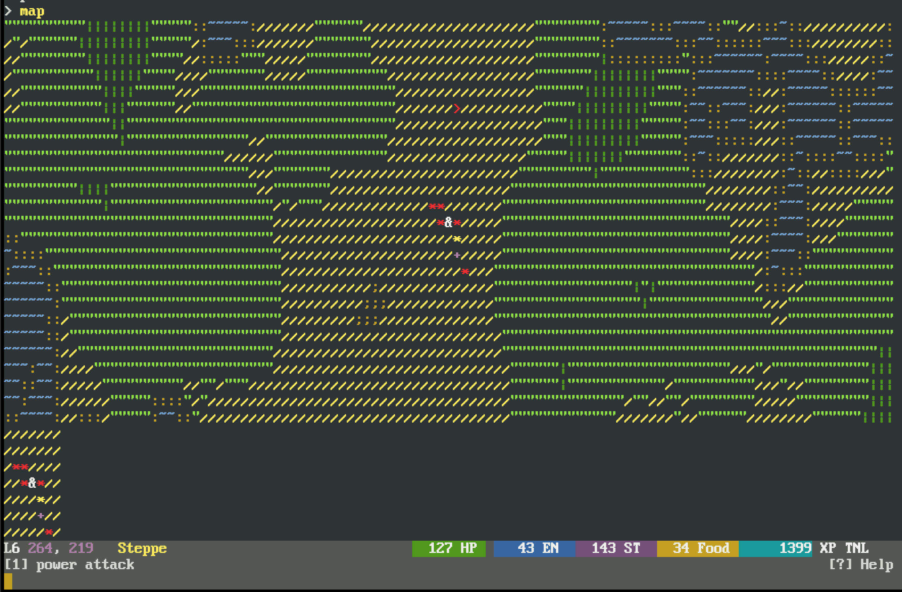
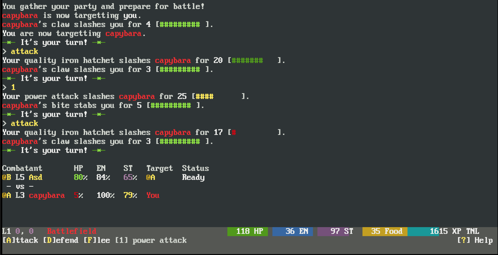
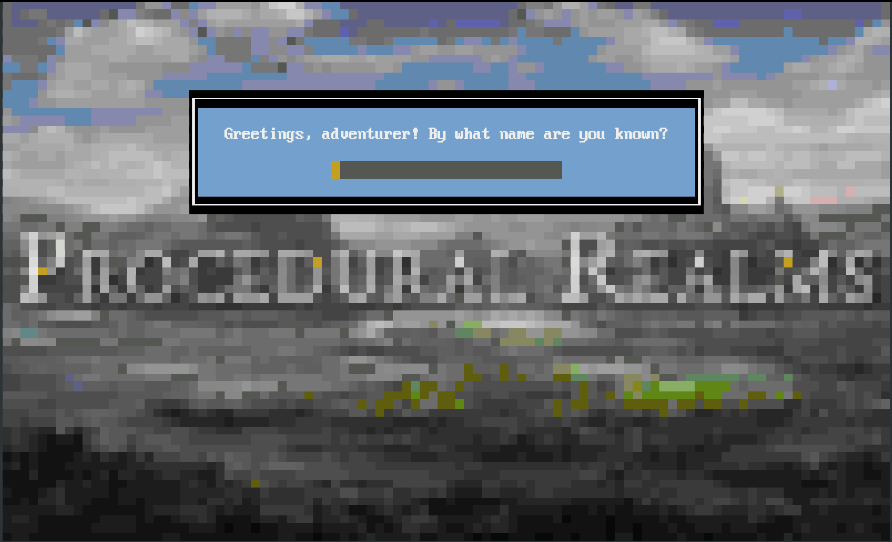

# procrealms-client
A character-mode terminal/web hybrid client for [Procedural Realms](http://www.proceduralrealms.com).  See it in action:

[http://play.proceduralrealms.com](http://play.proceduralrealms.com)

A few screenshots in the browser:





# In The Terminal

```
npm install
node index.js
```

# In The Browser

Use `browserify` to build for the browser:

```
npm install -g browserify
browserify index.js --ignore-missing -o www/js/bundle.js
```

Or see the build scripts in `utils` for more examples with minification, etc.

